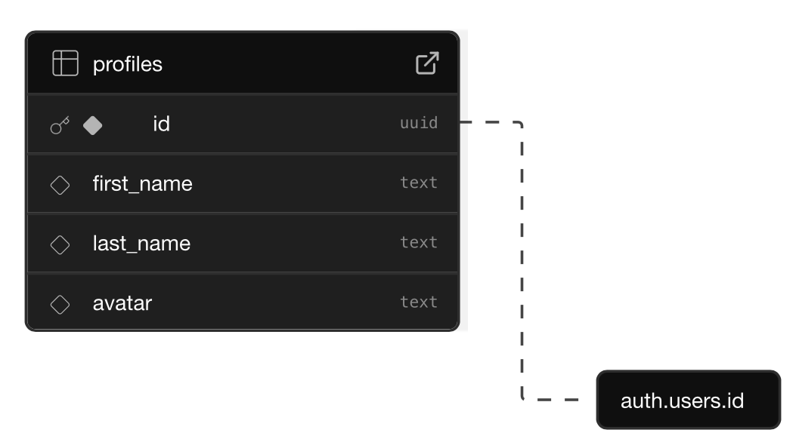

# Welcome to my Converse APP 👋

This is an [Expo](https://expo.dev) project created with [`create-expo-app`](https://www.npmjs.com/package/create-expo-app).

## Get started

### Supabase configuration

1. Install dependencies

   

2. Start the app

   ```bash
    npx expo start
   ```

### Application

1. Install dependencies

   ```bash
   npm install
   ```

2. Start the app

   ```bash
    npx expo start
   ```

In the output, you'll find options to open the app in a

- [development build](https://docs.expo.dev/develop/development-builds/introduction/)
- [Android emulator](https://docs.expo.dev/workflow/android-studio-emulator/)
- [iOS simulator](https://docs.expo.dev/workflow/ios-simulator/)
- [Expo Go](https://expo.dev/go), a limited sandbox for trying out app development with Expo

You can start developing by editing the files inside the **app** directory. This project uses [file-based routing](https://docs.expo.dev/router/introduction).

## Get a fresh project

When you're ready, run:

```bash
npm run reset-project
```

This command will move the starter code to the **app-example** directory and create a blank **app** directory where you can start developing.

## Build Android APK
[Inspired By](https://aymeric-cucherousset.fr/expo-generer-un-fichier-apk/)

Requirements :
- Eas-cli
```bash
npm install -g eas-cli   
```
- Add the .env values into eas, for each env values
```bash
eas secret:create 
```

Make the build with Expo cloud builder:
- Android build
```bash
eas build -p android --profile preview
```